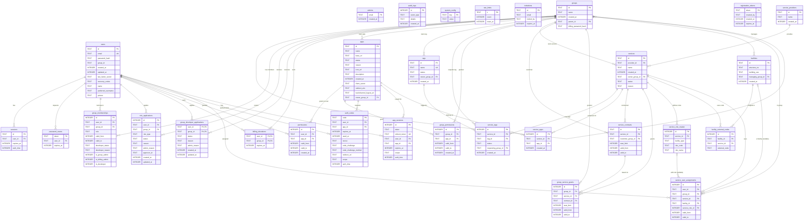

# Taisei-DaaS アカウントマネージャー 統合ER図

現在の `schema.sql` に定義されている全テーブル（約30個）とそのリレーションシップを網羅したER図です。
MarkdownのMermaid記法を使用しているため、拡大・縮小しても綺麗に表示され、テキストベースでの保守も容易です。

```mermaid
erDiagram
    %% ==========================================
    %% ユーザー・認証・システム基盤
    %% ==========================================
    users {
        TEXT id PK
        TEXT email UK
        TEXT password_hash
        TEXT group_id
        INTEGER created_at
        INTEGER updated_at
        TEXT two_factor_secret
        TEXT recovery_codes
        TEXT name
        TEXT preferred_username
        TEXT picture
    }
    sessions {
        TEXT id PK
        TEXT user_id FK
        INTEGER expires_at
        INTEGER auth_time
    }
    admins {
        TEXT email PK
        INTEGER created_at
    }
    audit_logs {
        INTEGER id PK
        TEXT event_type
        TEXT details
        INTEGER created_at
    }
    system_config {
        TEXT key PK
        TEXT value
    }
    rate_limits {
        TEXT k PK
        INTEGER count
        INTEGER reset_at
    }
    password_resets {
        TEXT token PK
        TEXT user_id FK
        INTEGER expires_at
    }
    invitations {
        TEXT id PK
        TEXT email
        TEXT invited_by
        INTEGER expires_at
    }

    %% ==========================================
    %% グループ・組織権限
    %% ==========================================
    groups {
        TEXT id PK
        TEXT name
        INTEGER created_at
        TEXT parent_id FK
        TEXT billing_password_hash
    }
    group_memberships {
        INTEGER id PK
        TEXT user_id FK
        TEXT group_id FK
        TEXT role
        INTEGER valid_from
        INTEGER valid_to
        TEXT developer_status
        TEXT developer_reason
        INTEGER is_group_admin
        INTEGER is_billing_admin
        INTEGER is_developer
    }
    role_applications {
        INTEGER id PK
        TEXT user_id FK
        TEXT group_id FK
        TEXT role_type
        TEXT status
        TEXT reason
        TEXT admin_reason
        TEXT approver_id
        INTEGER created_at
        INTEGER updated_at
    }
    group_developer_applications {
        TEXT user_id PK,FK
        TEXT group_id PK,FK
        TEXT status
        TEXT reason
        TEXT admin_reason
        INTEGER created_at
        INTEGER updated_at
    }
    billing_elevations {
        TEXT user_id PK,FK
        TEXT group_id PK,FK
        INTEGER expires_at
    }

    %% ==========================================
    %% アプリ・タグ・OIDC
    %% ==========================================
    apps {
        TEXT id PK
        TEXT name
        TEXT base_url
        TEXT status
        TEXT reason
        TEXT icon_url
        TEXT description
        INTEGER created_at
        TEXT client_secret
        TEXT redirect_uris
        TEXT backchannel_logout_uri
        TEXT owner_group_id FK
    }
    tags {
        TEXT id PK
        TEXT name UK
        TEXT status
        TEXT owner_group_id FK
        INTEGER created_at
    }
    service_tags {
        INTEGER id PK
        TEXT service_id FK
        TEXT tag_id FK
        TEXT status
        TEXT requesting_group_id FK
        INTEGER created_at
    }
    permissions {
        INTEGER id PK
        TEXT user_id FK
        TEXT app_id FK
        INTEGER valid_from
        INTEGER valid_to
        INTEGER created_at
    }
    group_permissions {
        INTEGER id PK
        TEXT group_id FK
        TEXT app_id FK
        INTEGER valid_from
        INTEGER valid_to
        INTEGER created_at
    }
    auth_codes {
        TEXT code PK
        TEXT user_id FK
        TEXT app_id FK
        INTEGER expires_at
        INTEGER used_at
        TEXT nonce
        TEXT code_challenge
        TEXT code_challenge_method
        TEXT redirect_uri
        TEXT scope
        INTEGER auth_time
    }
    app_sessions {
        INTEGER id PK
        TEXT token
        TEXT refresh_token UK
        TEXT user_id FK
        TEXT app_id FK
        INTEGER expires_at
        TEXT scope
        INTEGER auth_time
    }
    registration_tokens {
        TEXT token PK
        TEXT created_by
        INTEGER created_at
        INTEGER expires_at
    }

    %% ==========================================
    %% サービス・施設・割当 (DaaS Account Manager)
    %% ==========================================
    service_providers {
        TEXT id PK
        TEXT name
        INTEGER created_at
    }
    services {
        TEXT id PK
        TEXT provider_id FK
        TEXT name
        INTEGER created_at
        TEXT owner_group_id FK
        TEXT status
        TEXT reason
    }
    service_apps {
        INTEGER id PK
        TEXT service_id FK
        TEXT app_id FK
        INTEGER created_at
    }
    service_contracts {
        TEXT id PK
        TEXT service_id FK
        TEXT customer_group_id FK
        INTEGER seat_limit
        INTEGER valid_from
        INTEGER valid_to
    }
    group_service_grants {
        INTEGER id PK
        TEXT group_id FK
        TEXT service_id FK
        TEXT contract_id FK
        INTEGER seat_limit
        INTEGER valid_from
        INTEGER valid_to
    }
    facilities {
        TEXT id PK
        TEXT structure_no
        TEXT building_use
        TEXT managing_group_id FK
        INTEGER created_at
    }
    service_role_master {
        INTEGER id PK
        TEXT service_id FK
        TEXT facility_type
        TEXT role_code
        TEXT role_name
    }
    service_user_assignments {
        INTEGER id PK
        TEXT user_id FK
        TEXT group_id FK
        TEXT service_id FK
        TEXT facility_id FK
        INTEGER service_role_id FK
        INTEGER valid_from
        INTEGER valid_to
    }
    facility_external_codes {
        INTEGER id PK
        TEXT facility_id FK
        TEXT service_id FK
        TEXT external_code
    }

    %% ==========================================
    %% リレーションシップ
    %% ==========================================
    
    %% ユーザー系
    users ||--o{ sessions : "has"
    users ||--o{ password_resets : "requests"
    
    %% グループ階層
    groups ||--o{ groups : "parent"
    
    %% グループメンバーシップと申請
    users ||--o{ group_memberships : "belongs to"
    groups ||--o{ group_memberships : "has members"
    users ||--o{ role_applications : "applies"
    groups ||--o{ role_applications : "receives"
    users ||--o{ group_developer_applications : "applies"
    groups ||--o{ group_developer_applications : "receives"
    users ||--o{ billing_elevations : "sudo"
    groups ||--o{ billing_elevations : "sudo"

    %% アプリとタグとOIDC権限
    groups ||--o{ apps : "owns app"
    groups ||--o{ tags : "owns tag"
    services ||--o{ service_tags : "has tags"
    tags ||--o{ service_tags : "tagged to"
    groups ||--o{ service_tags : "requests tag"
    users ||--o{ permissions : "granted"
    apps ||--o{ permissions : "grants to user"
    groups ||--o{ group_permissions : "granted"
    apps ||--o{ group_permissions : "grants to group"
    users ||--o{ auth_codes : "authenticates"
    apps ||--o{ auth_codes : "requests"
    users ||--o{ app_sessions : "has"
    apps ||--o{ app_sessions : "issued for"

    %% サービス・プロバイダ・アプリ連携
    service_providers ||--o{ services : "provides"
    groups ||--o{ services : "owns service"
    services ||--o{ service_apps : "composed of"
    apps ||--o{ service_apps : "belongs to"

    %% サービス契約・利用枠（ゲート②）
    services ||--o{ service_contracts : "contracted"
    groups ||--o{ service_contracts : "customer"
    groups ||--o{ group_service_grants : "granted"
    services ||--o{ group_service_grants : "grants"
    service_contracts ||--o{ group_service_grants : "based on"

    %% 施設・マスタ（ゲート③基盤）
    groups ||--o{ facilities : "manages"
    services ||--o{ service_role_master : "defines roles"
    facilities ||--o{ facility_external_codes : "mapped to"
    services ||--o{ facility_external_codes : "uses code"

    %% ユーザー割当（ゲート③）
    users ||--o{ service_user_assignments : "assigned"
    groups ||--o{ service_user_assignments : "in group"
    services ||--o{ service_user_assignments : "uses"
    facilities |o--o{ service_user_assignments : "at facility (nullable)"
    service_role_master |o--o{ service_user_assignments : "with role (nullable)"
```
